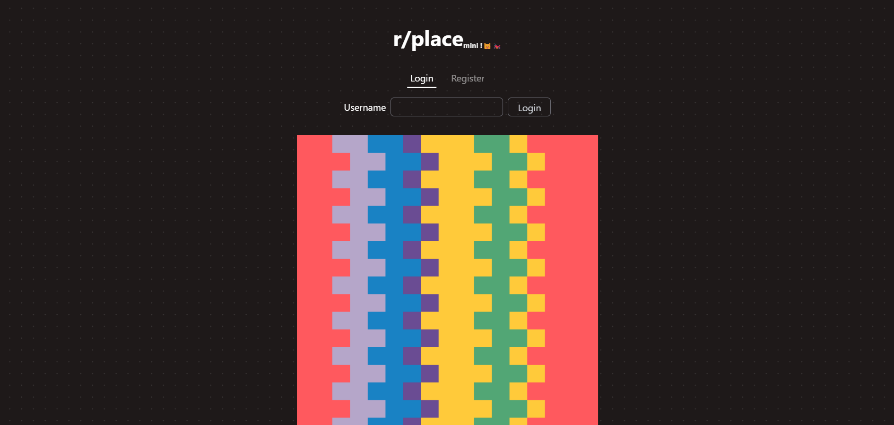
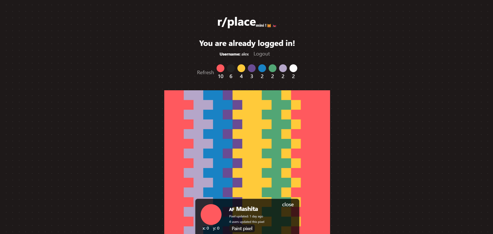

# Minirplace Frontend

Parte visual del proyecto, considera el uso de React y Typescript para el desarrollo de la aplicación, además de websockets para la comunicación en tiempo real con el backend.

## Stack tecnológico

  

## [Preview](https://alexbgh1.github.io/minirplace-frontend/)

## Soporte CSS

- [x] Desktop
- [x] Tablet
- [x] Mobile
